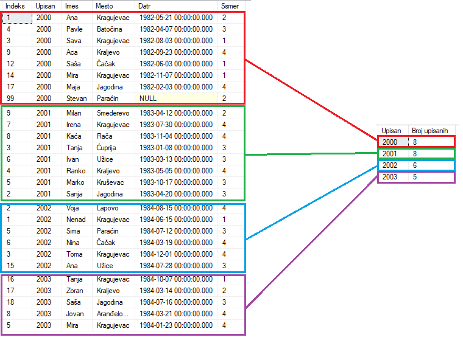

# Vežbe 6

- [Vežbe 6](#vežbe-6)
    - [Uvod](#uvod)
        - [Šta je SQL?](#šta-je-sql?)
        - [Šta može SQL](#šta-može-sql?)
        - [SQL Server](#sql-server)
        - [sqllocaldb](#sqllocaldb)
    - [Osnove SQL-a](#osnove-sql-a)
        - [CREATE](#create)
        - [USE](#use)
        - [TABLE](#table)
        - [Zašto zagrade](#zašto-zagrade)
        - [WHERE](#where)
        - [SELECT](#select)
        - [Logical operations (AND, OR, NOT)](#logical-operations)
        - [BETWEEN](#between)
        - [LIKE](#like)
        - [ORDER BY](#order-by)
        - [CONCAT](#concat)
        - [CAST](#cast)
        - [CASE](#case)
    - [Agregatne operacije](#agregatne-operacije)
        - [Šta su?](#šta-su?)
        - [SUM, COUNT, AVG, MIN, MAX](#sum-count-avg-min-max)
        - [GROUP BY](#group-by)
        - [HAVING](#having)

## Uvod

### Šta je SQL?

U današnje vreme, skoro u svakom domenu poslovanja, bilo da je reč o malim online prodavnicama ili velikim korporacijama, koriste se podaci. Ovim podacima se upravlja koristeći baze podataka. Zbog toga je velika potražnja za administratorima bazama podataka, posebno sa znanjem SQL baza podataka.

Podaci se nalaze u osnovi mnogih web aplikacija i aplikacija za mobilne telefone. Na primer, aplikacija kao što je Facebook sadrži podatke o korisniku, njegovim prijateljima, objavama itd. Da bi se ti podaci čuvali, koriste se baze podataka. SQL je programski jezik koji omogućava programerima da upravljaju tim podacima.

Skraćenica **SQL** odnosi se na **Structured Query Language**, tj. jezik strukturisanih upita. 

Prema definiciji W3School-a: "**SQL je standardni jezik za čuvanje, upravljanje i preuzimanje podataka u bazama podataka**".

U osnovi, to je jezik koji omogućava komunikaciju sa bazama podataka i upravljanjem svih podataka koje one sadrže.

**SQL nije proceduralni jezik, već deklarativni jezik**. To znači da pomoću SQL-a definišete šta želite da uradite (npr. izaberite podatke ili da ih ažurirate), ali ne navodite korake koje računar treba da preduzme da bi to postigao.

### Šta može SQL

Ovaj jezik ima razne namene u oblasti analize podataka, a posebno je koristan jer može da:

* Izvrši upite prema bazi podataka
* Preuzima podatke iz baze podataka
* Ažurira zapise u bazi podataka
* Izbriše zapise iz baze podataka
* Kreira nove baze podataka, ili nove tabele u bazi podataka
* Kreira procedure čuvanja i pregleda u bazi podataka
* Odredi dozvole pristupa za tabele, procedure i preglede u bazi

### SQL Server

SQL Server je softverski alat koji nudi Microsoft. To je sistem za upravljanje bazama podataka (DBMS) koji omogućava skladištenje i upravljanje podacima. SQL Server koristi SQL kao jezik za manipulaciju i upravljanje podacima.

* Skladištenje podataka: SQL Server omogućava kreiranje baza podataka za skladištenje strukturiranih podataka.

* Upravljanje podacima: Omogućava kreiranje, brisanje, ažuriranje i pretragu podataka koristeći SQL upite.

* Bezbednost: Pruža mehanizme za kontrolu pristupa podacima, kao što su korisnički nalozi, dozvole i enkripcija podataka.

* Backup i oporavak: SQL Server omogućava pravljenje sigurnosnih kopija podataka i oporavak u slučaju gubitka podataka.

* Repliciranje i kloniranje: Omogućava replikaciju podataka na više lokacija radi poboljšane dostupnosti i performansi.

* Biznis inteligencija: SQL Server sadrži alate za analizu podataka, izveštavanje i biznis inteligenciju.

### sqllocaldb

SQLLocalDB je verzija SQL Servera koja je namenjena razvojnim radnim stanicama i aplikacijama koje ne zahtevaju puni server za upravljanje bazom podataka. Ona pruža lak i jednostavan način za razvoj i testiranje aplikacija koje koriste SQL Server baze podataka.

* **Instalacija SQLLocalDB:** Prvi korak je instaliranje SQLLocalDB-a na vašem računaru. Možete preuzeti SQLLocalDB instalacione datoteke sa zvaničnog Microsoft sajta ili ih instalirati zajedno sa određenim razvojnim alatima kao što je Visual Studio.

* **Kreiranje instance**: Nakon instalacije, možete koristiti alat za upravljanje SQLLocalDB-om (npr. SQL Server Management Studio ili komandna linija) da biste kreirali novu instancu SQLLocalDB-a. To može biti urađeno jednostavnim pozivanjem odgovarajuće komande:

```
sqllocaldb create MyInstance
```

* **Pokretanje instance**: Nakon što je instanca kreirana, možete je pokrenuti pomoću odgovarajuće komande:

```
sqllocaldb start MyInstance
```

Ovo će pokrenuti instancu SQLLocalDB-a i omogućiti vam da počnete koristiti bazu podataka unutar te instance. Da bismo je ugasili, pokrećemo komandu:

```
sqllocaldb stop MyInstance
```

* **Pristupanje instanci**: Kada je instanca pokrenuta, možete pristupiti bazi podataka unutar nje koristeći uobičajene alate kao što su SQL Server Management Studio ili SQLCMD.

## Osnove SQL-a

Osnovna stvar vezana za SQL jeste da je on **case-insensitive** jezik, odnosno naredbe se mogu pisati velikim i malim slovom, i one predstavljaju istu naredbu:

```sql
SELECT * FROM [Studenti] WHERE Indeks = 22

-- isto kao
SElect * frOM Studenti where [indeks] = 22
```

### Zašto zagrade

Pri pisanju SQL koda, nazivi naših struktura(baza, tabela, kolona) može da se poklopi sa ključnim rečima samog jezika. Najosnovniji primer jeste ako kreiramo tabelu **user**, gde je reč user ključna reč samog jezika. Kako bi SQL znao da mi samo želimo da nazovemo našu strukturu tako, njen naziv pišemo između **[]** zagrada. 

Ova notacija nije obavezna, i određenje verzije neće praviti problem ni čak kada napišete ključnu reč kao naziv bez zagrada, već predstavlja samo savet za urednije pisanje koda.

### Baza STUDIJE

Kao i dok smo vežbali relacionu algebru, i za SQL deo koristićemo bazu STUDIJE.

U opisu kursa možete pronaći **.bak** fajl koji predstavlja backup fajl baze [STUDIJE](../materijali/STUDIJE.bak). Kako odraditi restore baze možete naći [ovde](https://www.youtube.com/watch?v=ntsigyCkCas)

### SELECT

**SELECT** je osnovna naredba SQL jezika jer njom definišemo šta želimo. Spada u DQL naredbe (Data query language). Ona uvek ide u paru sa rečju **FROM**, kojom definišemo odakle to želimo.

Predstavlja implementaciju **operacije projekcije** iz relacione algebre.

```sql
SELECT *
FROM [Studenti]
```

| Indeks | Upisan | Imes  | Mesto       | Datr                    | Ssmer |
|--------|--------|-------|-------------|-------------------------|-------|
| 1      | 2000   | Ana   | Kragujevac  | 1982-05-21 00:00:00.000 | 2     |
| 1      | 2002   | Nenad | Kragujevac  | 1984-06-15 00:00:00.000 | 1     |
| 2      | 2001   | Sanja | Jagodina    | 1983-04-20 00:00:00.000 | 3     |
| 2      | 2002   | Voja  | Lapovo      | 1984-08-15 00:00:00.000 | 4     |
| 3      | 2000   | Sava  | Kragujevac  | 1982-08-03 00:00:00.000 | 1     |
| 3      | 2001   | Tanja | Ćuprija     | 1983-01-08 00:00:00.000 | 3     |
| 3      | 2002   | Toma  | Kragujevac  | 1984-12-01 00:00:00.000 | 4     |
| 4      | 2000   | Pavle | Batočina    | 1982-04-07 00:00:00.000 | 3     |
| 4      | 2001   | Ranko | Kraljevo    | 1983-05-05 00:00:00.000 | 4     |
| 5      | 2001   | Marko | Kruševac    | 1983-10-17 00:00:00.000 | 3     |
| 5      | 2002   | Sima  | Paraćin     | 1984-07-12 00:00:00.000 | 3     |
| 5      | 2003   | Mira  | Kragujevac  | 1984-01-23 00:00:00.000 | 4     |
| 6      | 2001   | Ivan  | Užice       | 1983-03-13 00:00:00.000 | 3     |
| 6      | 2002   | Nina  | Čačak       | 1984-03-19 00:00:00.000 | 4     |
| 7      | 2001   | Irena | Kragujevac  | 1983-07-30 00:00:00.000 | 4     |
| 8      | 2001   | Kaća  | Rača        | 1983-11-04 00:00:00.000 | 4     |
| 8      | 2003   | Jovan | Aranđelovac | 1984-03-21 00:00:00.000 | 4     |

Pisanjem * definišemo da želimo sve kolone.

Ako želimo specifične kolone, navodimo ih redom odvojene zapetom.

```sql
SELECT [Mesto], [Imes]
FROM [Studenti]
```

| Mesto      | Imes  |
|------------|-------|
| Kragujevac | Ana   |
| Kragujevac | Nenad |
| Jagodina   | Sanja |
| Lapovo     | Voja  |
| Kragujevac | Sava  |
| Ćuprija    | Tanja |
| Kragujevac | Toma  |
| Batočina   | Pavle |
| Kraljevo   | Ranko |
| Kruševac   | Marko |
| Paraćin    | Sima  |
| Kragujevac | Mira  |
| Užice      | Ivan  |
| Čačak      | Nina  |
| Kragujevac | Irena |

Redosled je bitan, jer će nam tim redosledom kolone biti prikazane u tabeli.

#### DISTINCT

Projekcija u relacionoj algebri je automatski brisala duplikate. SELECT ne radi tako, već prikazuje iste redove. 

```sql
SELECT [Imes]
FROM [Studenti]
```

| Imes   |
|--------|
| Toma   |
| Pavle  |
| Ranko  |
| Marko  |
| Sima   |
| Mira   |
| Ivan   |
| Nina   |
| Irena  |
| Kaća   |
| Jovan  |
| Aca    |
| Milan  |
| Saša   |
| Mira   |
| Ana    |
| Tanja  |
| Maja   |
| Zoran  |
| Saša   |
| Stevan |

Ako želimo da nam se prikažu samo različiti, pišemo ključnu reč **DISTINCT** posle selecta:

```sql
SELECT DISTINCT [Imes]
FROM [Studenti]
```

#### AS

Ako želimo da promenimo naziv kolone, koristimo **AS**

```sql
SELECT DISTINCT [Imes] AS 'Ime studenta'
FROM [Studenti]
```

| Ime studenta |
|--------------|
| Aca          |
| Ana          |
| Irena        |
| Ivan         |
| Jovan        |
| Kaća         |
| Maja         |

#### Zadaci

* Prikazati spisak svih studenata
* Prikazati Imes, indeks, upisan, mesto iz tabele STUDENTI
* Prikazati Imes, Indeks, Upisan, Datr iz tabele studenti, gde je Datr naslovljena kao 'Datum rodjenja'
* Selektovati razli?ita mesta iz tabele Studenti, i dopisati kolonu sa NULL vrednostima

### WHERE

**WHERE** naredba služi za filtriranje redova. Predstavlja **restrikciju** iz relacione algebre.

Pomoću nje, uzimaju se samo redovi koji ispunjavaju logički uslov.

```sql
SELECT *
FROM [Studenti]
WHERE [Imes] = 'Aca'
```

| Indeks | Upisan | Imes  | Mesto       | Datr                    | Ssmer |
|--------|--------|-------|-------------|-------------------------|-------|
| 5      | 2003   | Mira  | Kragujevac  | 1984-01-23 00:00:00.000 | 4     |
| 8      | 2003   | Jovan | Aranđelovac | 1984-03-21 00:00:00.000 | 4     |
| 16     | 2003   | Tanja | Kragujevac  | 1984-10-07 00:00:00.000 | 1     |
| 17     | 2003   | Zoran | Kraljevo    | 1984-03-14 00:00:00.000 | 2     |
| 18     | 2003   | Saša  | Jagodina    | 1984-07-16 00:00:00.000 | 3     |

Za tekstualne kolone, potrebno je vrednost pisati unutar jednostrukih navodnika:

```sql
SELECT *
FROM [Studenti]
WHERE [Imes] = 'Aca'
```

| Indeks | Upisan | Imes | Mesto    | Datr                    | Ssmer |
|--------|--------|------|----------|-------------------------|-------|
| 9      | 2000   | Aca  | Kraljevo | 1982-09-23 00:00:00.000 | 4     |

**Zadaci**
* Prikazati podatke o studentima koji su upisani 2000 godine

#### IN

**IN** nam služi da ispitamo da li vrednost pripada skupu željenih vrednosti

```sql
SELECT *
FROM [Studenti]
WHERE [Imes] in ('Aca', 'Saša')
```

| Indeks | Upisan | Imes | Mesto    | Datr                    | Ssmer |
|--------|--------|------|----------|-------------------------|-------|
| 9      | 2000   | Aca  | Kraljevo | 1982-09-23 00:00:00.000 | 4     |
| 12     | 2000   | Saša | Čačak    | 1982-06-03 00:00:00.000 | 1     |
| 18     | 2003   | Saša | Jagodina | 1984-07-16 00:00:00.000 | 3     |

**Zadaci**
* Prikazati Studente koji su iz Kragujevca ili Kraljeva
* Prikazati Studente koji NISU iz Kragujevca ili Kraljeva

### Logical operations

#### AND

**AND** služi da filtrira redove na osnovu više uslova

```sql
SELECT *
FROM [Studenti]
WHERE [Imes] in ('Aca', 'Saša') AND [Indeks] < 10
```

| Indeks | Upisan | Imes | Mesto    | Datr                    | Ssmer |
|--------|--------|------|----------|-------------------------|-------|
| 9      | 2000   | Aca  | Kraljevo | 1982-09-23 00:00:00.000 | 4     |

#### OR

**OR** služi da filtrira redove na osnovu više uslova, ali je potrebno da barem jedan od datih uslova bude ispunjen. Pokušaćemo isti primer kao i iznad, samo sa **OR** umesto **AMD**.

```sql
SELECT *
FROM [Studenti]
WHERE [Imes] in ('Aca', 'Saša') OR [Indeks] < 10
```

| Indeks | Upisan | Imes  | Mesto       | Datr                    | Ssmer |
|--------|--------|-------|-------------|-------------------------|-------|
| 1      | 2000   | Ana   | Kragujevac  | 1982-05-21 00:00:00.000 | 2     |
| 1      | 2002   | Nenad | Kragujevac  | 1984-06-15 00:00:00.000 | 1     |
| 2      | 2001   | Sanja | Jagodina    | 1983-04-20 00:00:00.000 | 3     |
| 2      | 2002   | Voja  | Lapovo      | 1984-08-15 00:00:00.000 | 4     |
| 3      | 2000   | Sava  | Kragujevac  | 1982-08-03 00:00:00.000 | 1     |
| 3      | 2001   | Tanja | Ćuprija     | 1983-01-08 00:00:00.000 | 3     |
| 3      | 2002   | Toma  | Kragujevac  | 1984-12-01 00:00:00.000 | 4     |
| 4      | 2000   | Pavle | Batočina    | 1982-04-07 00:00:00.000 | 3     |
| 4      | 2001   | Ranko | Kraljevo    | 1983-05-05 00:00:00.000 | 4     |
| 5      | 2001   | Marko | Kruševac    | 1983-10-17 00:00:00.000 | 3     |


Operator **OR** prikazuje zapis ako je bilo koji od uslova tačan.

Operator **AND** prikazuje zapis ako su svi uslovi tačni.

#### NOT

Operator **NOT** se koristi u kombinaciji s drugim operatorima kako bi dao suprotan rezultat.

```sql
SELECT *
FROM [Studenti]
WHERE NOT [Indeks] < 40
```

| Indeks | Upisan | Imes  | Mesto       | Datr                    | Ssmer |
|--------|--------|-------|-------------|-------------------------|-------|
| 99     | 2000   | Ana   | Kragujevac  | 1982-05-21 00:00:00.000 | 2     |

### BETWEEN

Operator **BETWEEN** bira vrednosti unutar datog opsega. Te vrednosti mogu biti brojevi, tekst ili datumi.

Operator **BETWEEN** je inkluzivan: početne i krajnje vrednosti su uključene.

```sql
SELECT *
FROM [Studenti]
WHERE [Upisan] BETWEEN 2003 AND 2004
```

| Indeks | Upisan | Imes  | Mesto       | Datr                    | Ssmer |
|--------|--------|-------|-------------|-------------------------|-------|
| 5      | 2003   | Mira  | Kragujevac  | 1984-01-23 00:00:00.000 | 4     |
| 8      | 2003   | Jovan | Aranđelovac | 1984-03-21 00:00:00.000 | 4     |
| 16     | 2003   | Tanja | Kragujevac  | 1984-10-07 00:00:00.000 | 1     |
| 17     | 2003   | Zoran | Kraljevo    | 1984-03-14 00:00:00.000 | 2     |
| 18     | 2003   | Saša  | Jagodina    | 1984-07-16 00:00:00.000 | 3     |

Da biste prikazali proizvode izvan opsega prethodnog primera, koristite **NOT BETWEEN**:

```sql
SELECT *
FROM [Studenti]
WHERE [Upisan] NOT BETWEEN 2003 AND 2004
```

| Indeks | Upisan | Imes   | Mesto      | Datr                    | Ssmer |
|--------|--------|--------|------------|-------------------------|-------|
| 1      | 2000   | Ana    | Kragujevac | 1982-05-21 00:00:00.000 | 2     |
| 1      | 2002   | Nenad  | Kragujevac | 1984-06-15 00:00:00.000 | 1     |
| 2      | 2001   | Sanja  | Jagodina   | 1983-04-20 00:00:00.000 | 3     |
| 2      | 2002   | Voja   | Lapovo     | 1984-08-15 00:00:00.000 | 4     |
| 3      | 2000   | Sava   | Kragujevac | 1982-08-03 00:00:00.000 | 1     |
| 3      | 2001   | Tanja  | Ćuprija    | 1983-01-08 00:00:00.000 | 3     |
| 3      | 2002   | Toma   | Kragujevac | 1984-12-01 00:00:00.000 | 4     |
| 4      | 2000   | Pavle  | Batočina   | 1982-04-07 00:00:00.000 | 3     |
| 4      | 2001   | Ranko  | Kraljevo   | 1983-05-05 00:00:00.000 | 4     |
| 5      | 2001   | Marko  | Kruševac   | 1983-10-17 00:00:00.000 | 3     |
| 5      | 2002   | Sima   | Paraćin    | 1984-07-12 00:00:00.000 | 3     |
| 6      | 2001   | Ivan   | Užice      | 1983-03-13 00:00:00.000 | 3     |
| 6      | 2002   | Nina   | Čačak      | 1984-03-19 00:00:00.000 | 4     |

**Zadaci**
* Prikazati sve studente koji su upisani izmedju 2000 i 2005

### LIKE

**LIKE** operator se koristi u WHERE klauzuli kako bi se tražio određeni obrazac u koloni.

Postoje dva džokera koji se često koriste u vezi sa LIKE operatorom:

* Procenta (%) predstavlja nula, jedan ili više znakova.
* Donja crta (_) predstavlja jedan, jedini znak.

```sql
SELECT * 
FROM [Studenti]
WHERE [Mesto] LIKE '%evac';
```

Najkorišćeniji obrazci:
* **LIKE '%rec'** - zavrsava na rec
* **LIKE 'rec%'** - pocinje sa rec
* **LIKE '%rec%'** - rec se nalazi u sredini

Predstavlja sve studente kod kojih se mesto završava za **"evac"**

| Indeks | Upisan | Ime   | Mesto      | Datr                    | Ssnmer |
|--------|--------|-------|------------|-------------------------|--------|
| 1      | 2000   | Ana   | Kragujevac | 1982-05-21 00:00:00.000 | 2      |
| 1      | 2002   | Nenad | Kragujevac | 1984-06-15 00:00:00.000 | 1      |
| 3      | 2000   | Sava  | Kragujevac | 1982-08-03 00:00:00.000 | 1      |
| 3      | 2002   | Toma  | Kragujevac | 1984-12-01 00:00:00.000 | 4      |
| 5      | 2001   | Marko | Kruševac   | 1983-10-17 00:00:00.000 | 3      |
| 5      | 2003   | Mira  | Kragujevac | 1984-01-23 00:00:00.000 | 4      |
| 7      | 2001   | Irena | Kragujevac | 1983-07-30 00:00:00.000 | 4      |
| 14     | 2000   | Mira  | Kragujevac | 1982-11-07 00:00:00.000 | 1      |
| 16     | 2003   | Tanja | Kragujevac | 1984-10-07 00:00:00.000 | 1      |

Sve oznake koje **LIKE** koristi su:
* **%** - predstavlja 0 ili više karaktera
* **_** - predstavlja jedan karakter
* **[]** - predstavlja bilo koji jedan karakter iz zagrada
* **^** - predstavlja bilo koji jedan karakter koji nije u zagradama
* **-** - predstavlja bilo koji jedan karakter koji pripada intervacu (primer: LIKE 'a-d' je zapravo karakter a,b,c,d)

Kombinacijom oznaka i njihovih pozicija možemo da napravimo bilo koji obrazac

### ORDER BY

Ključna reč **ORDER BY** se koristi za sortiranje rezultata u rastućem (**ASC**) ili opadajućem (**DESC**) redosledu. 

Order by se pise na kraju, posle WHERE naredbe

```sql
SELECT *
FROM [Studenti]
-- WHERE [uslov]
ORDER BY [Imes] -- po defaultu se smatra ASC
```

| Indeks | Upisan | Imes   | Mesto       | Datr                    | Ssmer |
|--------|--------|--------|-------------|-------------------------|-------|
| 9      | 2000   | Aca    | Kraljevo    | 1982-09-23 00:00:00.000 | 4     |
| 15     | 2002   | Ana    | Užice       | 1984-07-28 00:00:00.000 | 3     |
| 1      | 2000   | Ana    | Kragujevac  | 1982-05-21 00:00:00.000 | 2     |
| 7      | 2001   | Irena  | Kragujevac  | 1983-07-30 00:00:00.000 | 4     |
| 6      | 2001   | Ivan   | Užice       | 1983-03-13 00:00:00.000 | 3     |
| 8      | 2003   | Jovan  | Aranđelovac | 1984-03-21 00:00:00.000 | 4     |
| 8      | 2001   | Kaća   | Rača        | 1983-11-04 00:00:00.000 | 4     |
| 17     | 2000   | Maja   | Jagodina    | 1982-02-03 00:00:00.000 | 4     |
| 5      | 2001   | Marko  | Kruševac    | 1983-10-17 00:00:00.000 | 3     |
| 5      | 2001   | Marko  | Kruševac    | 1983-10-17 00:00:00.000 | 3     |

```sql
SELECT *
FROM [Studenti]
ORDER BY [Imes] DESC
```

| Indeks | Upisan | Imes   | Mesto      | Datr                    | Ssmer |
|--------|--------|--------|------------|-------------------------|-------|
| 17     | 2003   | Zoran  | Kraljevo   | 1984-03-14 00:00:00.000 | 2     |
| 2      | 2002   | Voja   | Lapovo     | 1984-08-15 00:00:00.000 | 4     |
| 3      | 2002   | Toma   | Kragujevac | 1984-12-01 00:00:00.000 | 4     |
| 3      | 2001   | Tanja  | Ćuprija    | 1983-01-08 00:00:00.000 | 3     |
| 16     | 2003   | Tanja  | Kragujevac | 1984-10-07 00:00:00.000 | 1     |
| 99     | 2000   | Stevan | Paraćin    | NULL                    | 2     |
| 5      | 2002   | Sima   | Paraćin    | 1984-07-12 00:00:00.000 | 3     |
| 3      | 2000   | Sava   | Kragujevac | 1982-08-03 00:00:00.000 | 1     |

Moguće je sortirati po više kolona, gde će se sortiranje raditi redom (po prvoj koloni, pa po drugoj koloni, ...):

```sql
SELECT *
FROM [Studenti]
ORDER BY [Imes] DESC, [PrezImes] ASC
```

| Id | Indeks | Upisan | Ime      | Prezime   |
|----|--------|--------|----------|-----------|
| 41 | 41     | 2015   | Vladimir | Ivanovic  |
| 9  | 9      | 2008   | Vladimir | Jankovic  |
| 25 | 25     | 2024   | Vladimir | Ðordevic  |
| 12 | 12     | 2011   | Tijana   | Simic     |
| 28 | 28     | 2002   | Tijana   | Stankovic |
| 44 | 44     | 2018   | Tijana   | Ðordic    |
| 3  | 3      | 2002   | Stefan   | Nikolic   |
| 19 | 19     | 2018   | Stefan   | Petrovic  |

**Zadaci**
* Prikazati Studente koji NISU iz Kragujevca ili Kraljeva sortirane po imenu (od najmanjeg ka najvećem)

### CONCAT

Funkcija **CONCAT()** spaja dva ili više stringa u jedan.

```sql
SELECT CONCAT([Indeks], '/', [Upisan]) as 'Indeks studenta'
FROM [Studenti]
```

| Indeks studenta |
|-----------------|
| 1/2000          |
| 1/2002          |
| 2/2001          |
| 2/2002          |
| 3/2000          |
| 3/2001          |
| 3/2002          |
| 4/2000          |

### CAST

Funkcija CAST() u SQL Serveru se koristi za konverziju podataka iz jednog tipa podataka u drugi. Na primer, može se koristiti za konverziju stringa u broj, datuma u string, ili obrnuto, u zavisnosti od potrebe.

```sql
SELECT CAST(25.65 AS int);
```

| Broj  |
|-------|
| 25    |

### CASE

**Zadaci**
* Pronaci smestaj - Prikazati sve studente i dodati kolonu u kojoj za studente koji nisu iz kragujevca pise vrednost "Potraban smestaj", u suprotnom pise "Lokalno"
* Selektovati sve ocene iz prijava, i dodati kolonu koja za svaku ocenu ispisuje da li je ocena 
--		"Ispod proseka" (5,6), 
--		"Prosek" (7,8), 
--		"Odlicna" (9)
--		"Izuzetna" (10)

### DATE

#### GETDATE()

**GETDATE()** vraća trenutni datum i vreme. Povratna vrednost je tipa **DATE**, o kojoj ćemo više na drugom delu SQL kursa kada budemo radili **DDL** naredbe.

**GETDATE()** nema parametre.

```sql
SELECT GETDATE() as 'Danas'
```

| Danas                      |
|----------------------------|
| 2024-04-01 19:28:57.657    |

#### DATEPART(datepart, date):

**DATEPART** funkcija izvlači određeni deo datuma (npr. dan, mesec, godinu) kao integer vrednost.

```sql
SELECT DATEPART(YEAR, GETDATE()) AS Godina
```

| Godina         |
|----------------|
| 2024           |

**datepart** može imati neke od sledećih vrednosti:
* YEAR
* MONTH
* DAY
* HOUR
* MINUTE
* SECOND

#### DATENAME(datepart, date):

```sql
SELECT DATENAME(MONTH, GETDATE()) AS Mesec
```

| Mesec                |
|----------------------|
| April                |

#### DATEDIFF(datepart, startdate, enddate)

**DATEDIFF** Računa razliku između dva datuma u izabranim intervalima (npr. dani, meseci, godine).

```sql
SELECT DATEDIFF(MONTH, GETDATE() - 125, GETDATE()) as Razlika
```

**GETDATE() - 125 predstavlja datum pre 125 dana. Broj koji dodajemo/oduzimamo od datuma predstavljaju dani**

| Razlika  |
|----------|
| 5        |

**Zadaci**
* Prikazati godista i starost, svih studenata koji imaju vise od 25 godina

## Agregatne operacije

### Šta su?

U primenama je veoma često potrebno da se izračunaju određene statistike serija podataka. To može da bude zbir, proizvod, prosek tj. aritmetička sredina, najmanja ili najveća vrednost i slično. Prilikom izračunavanja ovih statistika od serije elemenata (tj. od svih elemenata jedne kolone tabele) gradi se jedan rezultat, tj. svi podaci se agregiraju u jedinstven rezultat. Zato se ove funkcije nazivaju agregatne funkcije.

### SUM, COUNT, AVG, MIN, MAX

#### SUM

Zbir elemenata neke kolone može da se dobije agregatnom funkcijom **SUM**.

```sql
SELECT SUM(Indeks) as 'Suma indeksa'
FROM [Studenti]
```

| Suma indeksa |
|--------------|
| 299          |

Koriscenjem **WHERE** mozemo da vrsimo agregaciju nad samo odabranim redovima.

```sql
SELECT SUM(Indeks) as 'Suma indeksa'
FROM [Studenti]
WHERE [Upisan] = 2002
```

| Suma indeksa |
|--------------|
| 32           |

#### COUNT

Ukupan broj redova neke tabele može da se dobije agregatnom funkcijom **COUNT**.

```sql
SELECT COUNT(*) as 'Broj studenata'
FROM [Studenti]
```

| Broj studenata |
|----------------|
| 27             |

Pošto mi radimo samo brojenje redova, kao argument **COUNT** funkcije možemo da prosledimo *, što znači da brojimo sve redove. Umesto *, možemo da prosledimo kolonu čije elemente brojimo.

#### COUNT i NULL vrednosti

Odradićemo isti primer kao iznad, ali ćemo umesto * napisati da brojimo po koloni Datr.

```sql
SELECT COUNT(Datr) as 'Broj studenata'
FROM [Studenti]
```

| Broj studenata |
|----------------|
| 26             |

Vidimo da se broj razliku od broja kad brojimo sa **COUNT(*)**. To je iz razloga što **COUNT** ne broji **NULL** vrednosti.

Ako odradimo selekciju studenata:

```sql
SELECT *
FROM [Studenti]
WHERE [Datr] IS NULL
```

| Indeks     | Upisan     | Ime    | Mesto   | Datr | SSmer |
|------------|------------|--------|---------|------|-------|
| 99         | 2000       | Stevan | Paraćin | NULL | 2     |

Vidimo da postoji student čiji je datum rođenja **NULL**, samim tim on neće biti izbrojan. Ako brojimo sa **COUNT(*)**, to onda nije problem.

#### MAX

Maksimalni element neke kolone može da se dobije agregatnom funkcijom **MAX**.

```sql
SELECT MAX(Indeks) as 'Max indeks'
FROM [Studenti]
```

| Max indeks |
|------------|
| 99         |

#### MIN

Minimalni element neke kolone može da se dobije agregatnom funkcijom **MIN**.

```sql
SELECT MIN(Indeks) as 'Min indeks'
FROM [Studenti]
```

| Min indeks |
|------------|
| 1          |

**Zadaci**
* Prikazati broj studenata koji su upisani na PMF-u
* Prikazati broj studenata koji su upisani na PMF-u, a imaju poznat datum rodjenja
* Prikazati prosecnu, minimalnu i maksimalnu ocenu na predmetu sa sifrom 23

### GROUP BY

Posmatrajmo sledeći primer:

```sql
SELECT COUNT(*) as 'Broj upisanih'
FROM [Studenti]
WHERE [Upisan] = 2003
```

| Broj upisanih |
|---------------|
| 5             |

U prethodnom primeru smo videli kako agregatne funkcije mogu da se primene na filtrirane podatke (podatke koji zadovoljavaju neki uslov). Često se javlja potreba da se ista vrsta upita ponovi za svaku vrednost u nekoj koloni. Na primer, sasvim je prirodno poželjeti da se odredi broj studenata za svaku upisanu godinu, a ne samo za jednu. Umesto da se postavlja više srodnih upita, ovakve statistike je moguće izračunati korišćenjem grupisanja i izračunavanja statistika po grupama. U jeziku SQL se za to koristi klauzula **GROUP BY**.

Kako bismo pronašli koliko je studenata upisano svake godine

```sql
SELECT [Upisan], COUNT(*) as 'Broj upisanih'
FROM [Studenti]
GROUP BY [Upisan]
```

| Upisan    | Broj studenata |
|-----------|----------------|
| 2000      | 8              |
| 2001      | 8              |
| 2002      | 6              |
| 2003      | 5              |

**Jako bitna stvar, potrebno je da se ako izuzmemo agregatne kolone, sve ostale kolone u SELECT-u poklapaju sa kolonama iz GROUP BY klauzule.**



Preko slike vidimo šta **GROUP BY** zapravo radi.

Grupisanje je moguće raditi po više kolona, na primer:

```sql
SELECT [Ssmer], [Mesto], COUNT(*) as 'Broj upisanih'
FROM [Studenti]
GROUP BY [Ssmer], [Mesto]
ORDER BY COUNT(*) DESC
```

| Ssmer | Mesto       | BrojUpisanij |
|-------|-------------|--------------|
| 1     | Kragujevac  | 4            |
| 4     | Kragujevac  | 3            |
| 3     | Užice       | 2            |
| 4     | Kraljevo    | 2            |
| 3     | Jagodina    | 2            |
| 4     | Jagodina    | 1            |
| 2     | Kragujevac  | 1            |
| 4     | Aranđelovac | 1            |
| 3     | Batočina    | 1            |
| 1     | Čačak       | 1            |

Važno je samo da neagregatne kolone odgovaraju **GROUP BY-u**.

**Zadaci**
* Za svako mesto ispisati koliko studenata dolazi iz njega.
* Za svako godiste studenata koje se pojavljuje u tabeli Studenti, ispisati broj studenata koji su rodjeni te godine.
* Sa svakog studenta (indeks, upisan) ispisati koliko ispita je polozio i njegovu prosecnu ocenu

### HAVING

**HAVING** je selekcija nakon grupisanja.

Kada se izračunavaju statistike po grupama, možemo poželeti da ponovo filtriramo podatke, tj. da odaberemo koje grupe želimo da budu prikazane na osnovu vrednosti izračunatih statistika. U ovom slučaju filtriranje podataka može i treba da se obavi tek nakon izračunavanja broja učenika u svim grupama.

Na primer, ako želimo da za primer iznad, izdvojimo sve godine na kojima je upisano više nego neki broj studenata. To radimo ovako:

```sql
SELECT [Upisan], COUNT(*) as BrojUpisanih
FROM [Studenti]
GROUP BY [Upisan]
HAVING COUNT(*) > 7
```

| Upisan    | BrojUpisanih |
|-----------|--------------|
| 2000      | 8            |
| 2001      | 8            |

**NOTACIJA**

U primeru iznad, mi smo kolonu koja predstavlja agregaciju COUNT(*) nazvali BrojUpisanih. Pošto to predstavlja naziv kolone, mi bi u **HAVING** klauzuli mogli da umesto agregatne funkcije, pišemo taj naziv.

```sql
SELECT [Upisan], COUNT(*) as BrojUpisanih
FROM [Studenti]
GROUP BY [Upisan]
HAVING BrojUpisanih > 7
```

```
Msg 207, Level 16, State 1, Line 4
Invalid column name 'BrojUpisanih'.

Completion time: 2024-04-01T19:18:45.5669759+02:00
```

Vidimo da ovo zapravo neće raditi, a razlog je redosled kojim SQL izvršava naredbe. Možemo rećo da se **AS** izvršava na kraju, i u trenutku kada se **HAVING**, naziv BrojUpisanih još nije definisan. 

Struktura SQL koda:

```sql
SELECT column_name, aggregate_function(column_name)
FROM table_name
WHERE column_name operator value
GROUP BY column_name
HAVING aggregate_function(column_name) operator value;
ORDER BY column_name [ASC|DESC]
```

**Zadaci**
* Prikazati sve studente koji imaju prosek veci od 6
* Koji predmeti se drze na vise razli?itih smerova (group by + having)
* Koliko ima predmeta na svakoj godini?
* Za svaki predmet ispisati kada je poslednji put polagan?
* Poslednji polozen predmet za svakog studenta?
* Za svaki ispitni rok ispisati koliko se u njemu polozilo ispita do sada?
* Prikazati uspeh (prosecnu ocenu) svake generacije
