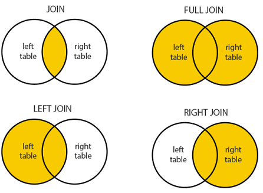

# Vežbe 8

- [Vežbe 8](#vežbe-8)
  - [Ugnježdeni upiti](#ugnježdeni-upiti)
    - [Nezavisni ugnježdeni upiti](#nezavisni-ugnježdeni-upiti)
    - [ALL i ANY](#all-i-any)
    - [EXISTS](#exists)
    - [Korelisani ugnježdeni upiti](#korelisani-ugnježdeni-upiti)
 
## Uvod

Na početku poglavlja o bazama podataka smo videli da smeštanje svih podataka u jednu veliku tabelu dovodi do redundantnosti, neefikasnosti i povećava mogućnost nastanka grešaka. Zbog toga su podaci u bazi podataka organizovani u više tabela.

Sa druge strane, svi dosadašnji upiti su čitali podatke isključivo iz jedne tabele. U mnogim situacijama nam to nije dovoljno, već je potrebno da se podaci iz dve ili više tabela povežu i prikažu zajedno u rezultatu.

## Implicitno spajanje

Prvi način da se dve ili više tabela spoje je tzv. **implicitno spajanje**. Naime, ako se nakon **FROM** navede više tabela razdvojenih zarezima, izračunava se njihov **Dekartov proizvod**. U slučaju dve tabele to znači da se svaka vrsta prve tabele kombinuje sa svakom vrstom druge tabele. U slučaju više tabela svaka takva vrsta bi se kombinovala sa svakom vrstom naredne tabele, itd.

```sql
SELECT *
FROM [Nastavnici] n, [Angazovanje] a
```

| Snast | Ime      | Snast | Spred | Ssmer |
|-------|----------|-------|-------|-------|
| 1     | Petrović | 1     | 1     | NULL  |
| 1     | Petrović | 1     | 19    | 2     |
| 1     | Petrović | 2     | 2     | NULL  |
| 1     | Petrović | 2     | 11    | NULL  |
| 1     | Petrović | 3     | 3     | NULL  |
| 1     | Petrović | 3     | 4     | NULL  |
| 1     | Petrović | 4     | 5     | NULL  |
| 1     | Petrović | 4     | 9     | NULL  |

Vidimo da se svaki red iz tabele **Nastavnici** spojio sa svakim redom iz tabele **Angazovanje**.

Tako dobijenu tabelu mozemo filtrirati da nam uzme samo one redove.

**Zadatak:** izlistati imena nastavnika i sifre predmeta koje predaju.

U upitu iznad, dodacemo uslov tako da nam ostanu samo nastavnici i njihovi predmeti koji oni predaju.

```sql
SELECT *
FROM [Nastavnici] n, [Angazovanje] a
WHERE n.[Snast] = a.[Snast]
```

| Snast | Ime      | Snast | Spred | Ssmer |
|-------|----------|-------|-------|-------|
| 1     | Petrović | 1     | 1     | NULL  |
| 1     | Petrović | 1     | 19    | 2     |
| 2     | Tomić    | 2     | 2     | NULL  |
| 2     | Tomić    | 2     | 11    | NULL  |
| 3     | Marić    | 3     | 3     | NULL  |
| 3     | Marić    | 3     | 4     | NULL  |
| 4     | Marković | 4     | 5     | NULL  |
| 4     | Marković | 4     | 9     | NULL  |
| 5     | Nikolić  | 5     | 6     | NULL  |

## JOIN

U bazama podataka postoji nekoliko različitih operatora spajanja: **INNER JOIN**, **CROSS JOIN**, **LEFT JOIN**, **RIGHT JOIN**, **FULL JOIN**.

Oni se uglavnom razlikuju po tome šta se dešava u situaciji kada u jednoj od spojenih tabela ne postoji red koji bi trebalo spojiti.



### INNER JOIN

**INNER JOIN** klauzula bira redove koji imaju podudarajuće vrednosti u obe tabele.

**JOIN** klauzula se koristi za spajanje redova iz dve ili više tabela, bazirano na povezanoj koloni između njih.

**Zadatak:** izlistati imena nastavnika i sifre predmeta koje predaju.

```sql
SELECT *
FROM [Nastavnici] n
INNER JOIN [Angazovanje] a
ON n.[Snast] = a.[Snast]
```

### LEFT JOIN

Ključna reč LEFT JOIN vraća sve zapise iz leve tabele i podudarajuće zapise iz desne tabele.Ako nema podudaranja, rezultat je 0 zapisa sa desne strane .

```sql
SELECT *
FROM [Nastavnici] n
LEFT JOIN [Angazovanje] a
ON n.[Snast] = a.[Snast]
```

### RIGHT JOIN

Ključna reč **RIGHT JOIN** vraća sve zapise iz desne tabele i podudarajuće zapise iz leve tabele. Rezultat su 0 zapisa sa leve strane ako nema podudaranja.

```sql
SELECT *
FROM [Nastavnici] n
RIGHT JOIN [Angazovanje] a
ON n.[Snast] = a.[Snast]
```

### FULL OUTER JOIN

```sql
SELECT *
FROM [Nastavnici] n
FULL OUTER JOIN [Angazovanje] a
ON n.[Snast] = a.[Snast]

SELECT *
FROM [Nastavnici] n
FULL JOIN [Angazovanje] a
ON n.[Snast] = a.[Snast]
```

### CROSS JOIN

**CROSS JOIN** spaja svaki red jedne tabele sa svakim redom druge tabele. Ovo je dekartov proizvod dve tabele.

* u odsustvu **WHERE** uslova, **CROSS JOIN** će se ponašati kao **dekartov proizvod**
* U prisustvu **WHERE** uslova, ovo JOIN će funkcioništi kao **INNER JOIN**.

```sql
SELECT *
FROM [Nastavnici] n
CROSS JOIN [Angazovanje] a
WHERE n.[Snast] = a.[Snast]
```

## ZADACI

- Izlistati imena nastavnika i sifre predmeta koje predaju (u skupu trebaju da se nadju i nastavnici koji nisu angazovani)
- Spisak nastavnika koji nisu angazovani.
- Spisak nastavnika i predmeta (samo sifre) koji dele predmet sa jos nekim
- Izlistati imena nastavnika i NAZIVE predmeta koje predaju
- Spisak brucosa koji imaju druga na fakultetu (iz istog mesta i ista godina upisa)
- Spisak studenata (indeks, upisan, ime studenta) koji imaju bar jedan polozen ispit
- Spisak studenata koji imaju prosek veci od 7.5
- Maksimalna ocena za svaki predmet

<!--
- Izlistati imena nastavnika i sifre predmeta koje predaju (u skupu trebaju da se nadju i nastavnici koji nisu angazovani)

	select n.Imen, a.Spred
	from Nastavnici n LEFT join Angazovanje a on n.Snast = a.Snast

- Spisak nastavnika koji nisu angazovani.

	select n.Snast 
	from Nastavnici n left join Angazovanje a on n.Snast = a.Snast
	where a.Snast is null

- Spisak nastavnika i predmeta (samo sifre) koji dele predmet sa jos nekim

	select a1.Snast, a1.Spred
	from Angazovanje a1 join Angazovanje a2 on a1.Spred = a2.Spred and a1.Snast <> a2.Snast

- Izlistati imena nastavnika i NAZIVE predmeta koje predaju
		
	select n.Imen, p.NAZIVP
	from Nastavnici n join Angazovanje a on n.Snast = a.Snast
				      join PREDMETI p on a.Spred = p.SPRED

- Spisak brucosa koji imaju druga na fakultetu (iz istog mesta i ista godina upisa)

	select s1.Imes, s2.Imes
	from Studenti s1 join Studenti s2 on (s1.Upisan = s2.Upisan and s1.Mesto = s2.Mesto and s1.Indeks != s2.Indeks)

- Spisak studenata (indeks, upisan, ime studenta) koji imaju bar jedan polozen ispit

	select distinct s.Indeks, s.Upisan, s.Imes
	from Studenti s join Prijave p on s.Indeks = p.Indeks and s.Upisan = p.Upisan
	where p.Ocena > 5 

- Spisak studenata koji imaju prosek veci od 7.5

	select s.Indeks, s.Upisan, avg(p.Ocena * 1.0)
	from Studenti s join Prijave p on s.Indeks = p.Indeks and s.Upisan = p.Upisan
	where p.Ocena > 5 
	group by s.Indeks, s.Upisan
	having avg(p.Ocena * 1.0) > 7.5

- Maksimalna ocena za svaki predmet

	select p2.Spred, p2.NAZIVP, max(ocena) 
	from prijave p1 join PREDMETI p2 on p1.Spred = p2.SPRED
	group by p2.NAZIVP, p2.Spred
-->
